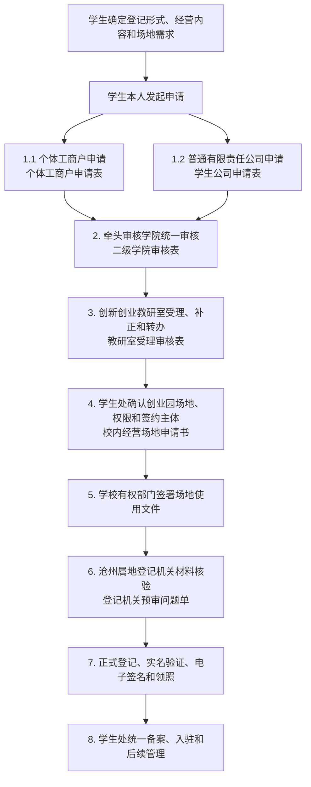

# 沧州交通学院学生创业登记办理手册

> 本手册处理两类登记：个体工商户和普通有限责任公司。它是学校沟通、材料准备和登记预审用的工作文件，不是沧州交通学院正式办事指南，也不是对登记结果的保证。

## 一、总流程

## 二、两条登记路径

### A. 个体工商户

适合一名学生个人试运行。材料重点是经营者身份、经营范围、经营场所合法使用证明和实名验证。个体工商户不适用公司股东“认缴/实缴”制度。

### B. 普通有限责任公司

适合学生团队、长期运营、对外签约或代际传承。材料除了住所和经营范围外，还要形成股东、注册资本、认缴出资、实缴出资和出资期限记录。

普通有限公司没有统一法定最低注册资本。股东认缴出资原则上应按照公司章程在成立后五年内缴足；实际缴款应进入公司银行账户，不是交给工商局或学校。[《中华人民共和国公司法》](https://www.npc.gov.cn/npc/c2/c30834/202312/t20231229_433999.html)

## 三、公司路径的出资审核清单

教研室和学校在受理公司申请时，建议确认：

1. 注册资本是否与项目规模相称；
2. 每名股东的认缴金额、比例和期限；
3. 首期实缴金额、来源、日期和方式；
4. 实缴资金是否进入公司银行账户；
5. 外部资金是股权投资还是公司借款；
6. 外部出资方是否成为股东；
7. 学生是否保持实际经营权和控制性股权；
8. 是否存在名义股东或抽逃出资风险；
9. 学生退出时如何处理股权、借款、合同、账号和客户资料；
10. 学校是否另有最低注册资本、最低实缴、保证金或启动资金要求。

“学生团队出资不低于30%”不是全国统一法律要求。它如果出现在某所高校制度中，首先是该校入驻条件；是否必须登记前实缴，还要看该校正式条文。沧州交通学院可以制定不同规则，不能直接把其他学校的30%作为工商登记要求。

## 四、每一步需要什么文件

| 步骤 | 申请人要做什么 | 对应文件 | 交给谁 | 必须留下的证据 |
|---|---|---|---|---|
| 1 | 确定登记形式和经营信息 | 经营信息表、经营范围初稿 | 自己留存 | 信息版本和日期 |
| 1.1 | 个体工商户申请 | [个体工商户申请表](templates/student-individual-business-application.md) | 学生本人 | 申请表、日期、附件清单 |
| 1.2 | 普通有限责任公司申请 | [学生公司申请表](templates/student-company-application.md) | 学生本人 | 股东、认缴、实缴和资金安排 |
| 2 | 学院统一审核 | [二级学院审核表](templates/college-review-form.md) | 牵头审核学院指定审核人 | 审核结论、签字、盖章 |
| 3 | 教研室受理 | [教研室受理审核表](templates/innovation-office-review-form.md) | 创新创业教研室 | 受理编号、补正、转办记录 |
| 4 | 场地申请 | [校内经营场地申请书](templates/campus-venue-application.md) | 学生处及授权部门 | 房间号、期限和场地意见 |
| 5 | 登记机关材料核验 | [登记机关预审问题单](templates/hebei-registration-precheck.md) | 沧州属地登记机关 | 材料核验结果、补正清单 |
| 6 | 正式登记和领照 | [官方申请与核验入口](official-links.md) | 登记机关 | 申请编号、电子签名、营业执照 |
| 7 | 学校备案 | 营业执照、协议、承诺和交接材料 | 学生处统一归口 | 备案回执、入驻档案 |

## 五、学校内部责任边界

- 学生本人：真实填写材料，完成登记并承担经营责任；
- 二级学院：由学校指定一个牵头审核学院；该学院指定统一审核人，代表涉及的其他二级学院完成统一审核，并负责核实学生身份、学业影响、经营内容和基本风险；
- 创新创业教研室：直接受理、编号、补正、协调和形成审核结论；
- 学生处：统一负责创业园资产、场地、入驻权限、领照备案、入驻档案、后续管理和学生退出交接；
- 其他部门：仅在涉及消防、用电、设备、实验/实训、材料存放、客户到访等事项时按学生处需要协同。

指导教师不作为本登记流程的默认前置条件。学院审核不等于学校对经营结果担保，教研室受理也不等于登记机关已经批准。

### 牵头审核学院规则

学生团队涉及多个二级学院时，不要求多个学院重复审核。学校应在流程开始时指定一个牵头审核学院，并通过书面通知、授权单或流程表明确其主导权和核实权。牵头审核学院可以向其他相关学院核验学生身份、学业影响和必要事项，但由牵头学院统一出具审核结论并承担校内审核流转责任。该规则属于本试点建议，最终以学校正式授权为准。

## 六、场地和登记机关边界

学校应先确认实验楼 A 四楼、五楼的具体房间、使用期限、签约主体和可以出具的文件类型。沧州交通学院是民办学校，不是市场监管或行政审批机关，不负责核发营业执照；登记机关仍要核验学校提供的场地使用、授权、权属或其他合法使用证明。推荐先线下或电话核验，再线上正式提交。

不要把学校入驻通知、场地使用协议、无偿使用证明、租赁协议、权属/管理权说明和登记机关认可的经营场所合法使用证明混为一谈。

线上可从[河北省政务服务网](https://zwfw.hebei.gov.cn/)或[河北省市场监督管理局网上办事平台](http://s.hebamr.cn/bsdt/)进入。具体窗口和材料以沧州经营场所所在地登记机关当日答复为准。

## 七、什么情况算流程跑通

- 学校确认学生可以选择相应登记形式；
- 学生处确认具体房间、期限、管理权限和签约主体；
- 场地材料通过沧州登记机关预审；
- 公司路径的股东、认缴、实缴和资金安排已经书面记录；
- 学生完成实名验证和设立登记；
- 成功取得营业执照；
- 营业执照和场地协议提交学生处统一备案；
- 后续地址、经营范围、年报、财务和退出交接有人负责。

## 八、当前待确认事项

- 学生处是否具有对外签署场地协议的授权；
- 学校是否允许创业园地址登记个体工商户或公司；
- 公司路径是否设置最低注册资本、学生持股比例或最低实缴要求；
- 外部出资方是否可以成为股东或向学生公司提供借款；
- 学生退出、毕业和代际传承时如何办理股权及经营资料交接；
- 具体房间是否满足消防、用电、设备和登记要求。

这些事项必须保留正式回复、窗口记录或盖章文件，不能只凭口头判断。
